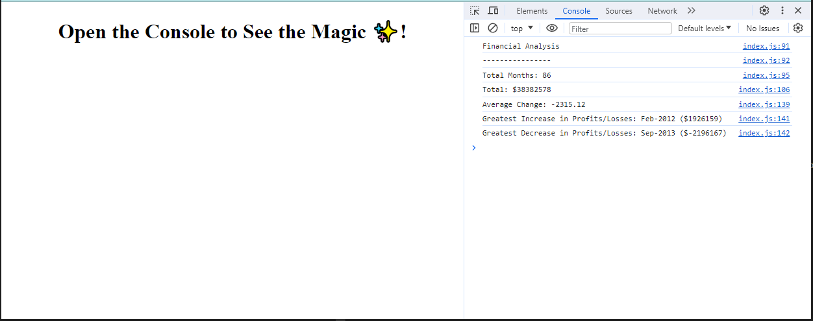

# Console-Finances

## Description

 This code can analyze the financial records of a company. I've used the 'for loop' to calculate the greatest increase and decrease in profit/losses.

## Installation

N/A

## Usage

You can try out the website if you click this link:

[https://sara-badini-confalonieri.github.io/console-finances/](https://sara-badini-confalonieri.github.io/Console-Finances/)

To see the Javascript file in action, open the Chrome DevTools by pressing Command+Option+I (macOS) or Control+Shift+I (Windows) and select the console tab.

## Credits

N/A

## License

Please refer to the LICENSE in the repo.
